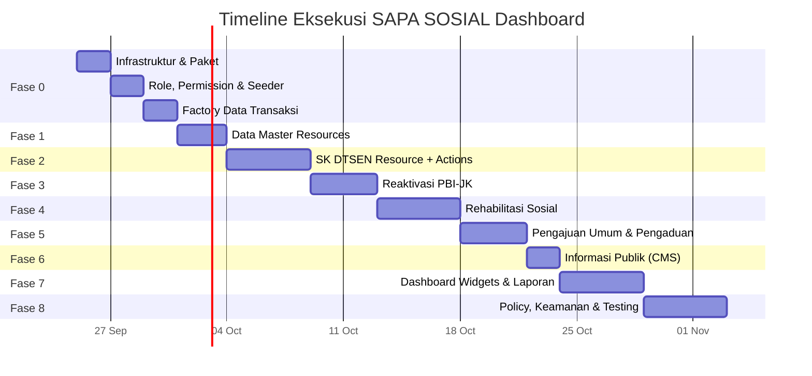

# 🏗️ Rencana Aksi — Dashboard SAPA SOSIAL (Filament v5)

> **Proyek:** SAPA SOSIAL — Satu Pintu Layanan Sosial Kabupaten Blitar
> **Stack:** Laravel 13 · Filament v5.8 · Livewire v4 · PostgreSQL
> **Tanggal:** 25 September 2026

---

## Status Proyek Saat Ini

| Komponen | Status |
|----------|--------|
| Models (31 file) | ✅ Selesai — semua tabel dari PRD sudah ada model-nya |
| Enums (14 file) | ✅ Selesai — semua status enum sudah lengkap dengan `label()` bahasa Indonesia |
| Migrations (34 file) | ✅ Selesai — semua tabel sesuai ERD di PRD |
| Factories | ⚠️ Hanya `UserFactory` — factory lain belum dibuat |
| Filament Panel | ⚠️ Baru `AdminPanelProvider` default — belum ada Resource, Widget, atau Page kustom |
| Policies | ❌ Belum ada |
| Spatie Permission | ❌ Belum dipasang |
| Spatie Activity Log | ❌ Belum dipasang (migrasi manual sudah ada) |
| Portal Publik | ❌ Belum ada |

---

## Fase 0 — Persiapan Infrastruktur

> [!IMPORTANT]
> Fase ini **wajib selesai lebih dulu** karena menjadi fondasi bagi seluruh fase berikutnya.

### 0.1 Instalasi & Konfigurasi Paket Pendukung

| # | Task | Detail |
|---|------|--------|
| 0.1.1 | Install `spatie/laravel-permission` | `composer require spatie/laravel-permission`, publish migrasi & config, jalankan migrate |
| 0.1.2 | Install `spatie/laravel-activitylog` | `composer require spatie/laravel-activitylog`, publish config, sesuaikan migrasi yang sudah ada |
| 0.1.3 | Tambahkan trait ke User model | Tambah `HasRoles` (Spatie Permission) dan `LogsActivity` (Spatie Activity Log) di [User.php](file:///c:/laragon/www/app-layanan/app/Models/User.php) |
| 0.1.4 | Konfigurasi PostgreSQL | Pastikan `.env` menggunakan `DB_CONNECTION=pgsql`, timezone `Asia/Jakarta` |
| 0.1.5 | Install paket ekspor & PDF | `maatwebsite/excel`, `barryvdh/laravel-dompdf` atau `spatie/laravel-pdf` |
| 0.1.6 | Install paket QR Code | `simplesoftwareio/simple-qrcode` untuk verifikasi SK DTSEN |

### 0.2 Definisi Role & Permission

| # | Task | Detail |
|---|------|--------|
| 0.2.1 | Buat Seeder role | Seeder untuk 6 role: `administrator`, `petugas_dinsos`, `pejabat_penandatangan`, `pimpinan`, `operator_kecamatan_desa`, `masyarakat` |
| 0.2.2 | Buat Seeder permission | Permission per modul: `service_request.*`, `dtsen.*`, `pbi.*`, `rehabilitation.*`, `complaint.*`, `information.*`, `report.*`, `user.*`, `master.*` |
| 0.2.3 | Mapping role → permission | Seeder yang menghubungkan setiap role dengan permission yang sesuai PRD Bagian 1 |
| 0.2.4 | Buat admin user seeder | Seeder user admin default untuk development |

### 0.3 Factory & Seeder Data Master

| # | Task | Detail |
|---|------|--------|
| 0.3.1 | Factory: `DistrictFactory`, `VillageFactory` | Data kecamatan/desa Kabupaten Blitar |
| 0.3.2 | Factory: `WorkUnitFactory` | Unit kerja Dinas Sosial |
| 0.3.3 | Factory: `ServiceTypeFactory`, `ServiceRequirementFactory` | Jenis layanan (DTSEN, PBI, Rehsos, Umum) beserta persyaratannya |
| 0.3.4 | Factory: `DtsenPurposeFactory` | Tujuan SK DTSEN (SPMB, PIP, KIP Kuliah, dll.) dengan `max_decile` |
| 0.3.5 | Factory: `ClientCategoryFactory` | Kategori klien rehabilitasi |
| 0.3.6 | Factory: `ComplaintCategoryFactory` | Kategori pengaduan |
| 0.3.7 | Factory: `ReferralInstitutionFactory` | Lembaga rujukan |
| 0.3.8 | Seeder data master wilayah | Kecamatan & desa Kabupaten Blitar (data riil) |
| 0.3.9 | Buat `DatabaseSeeder` terpadu | Menjalankan semua seeder di atas dalam urutan yang benar |

### 0.4 Factory Data Transaksi (untuk testing & demo)

| # | Task | Detail |
|---|------|--------|
| 0.4.1 | `ServiceRequestFactory` | Dengan state untuk setiap status, termasuk relasi ke `ServiceType` |
| 0.4.2 | `DtsenCertificateFactory` | Termasuk state `issued`, `pending` |
| 0.4.3 | `PbiReactivationFactory` | Termasuk state per tahap proses |
| 0.4.4 | `ComplaintFactory`, `ComplaintAttachmentFactory` | Termasuk state per status pengaduan |
| 0.4.5 | `ClientFactory`, `RehabilitationCaseFactory` | Termasuk state per status kasus |
| 0.4.6 | `AssessmentFactory`, `ReferralFactory`, `MonitoringRecordFactory` | Untuk data pelayanan rehabilitasi |
| 0.4.7 | `InformationPageFactory`, `FaqFactory`, `DownloadableFormFactory` | Untuk konten informasi |
| 0.4.8 | `StatusHistoryFactory`, `DispositionFactory`, `ApprovalFactory` | Untuk audit trail |

---

## Fase 1 — Data Master (Filament Resources)

> Panel admin `/admin` — modul pengelolaan data master oleh Administrator.

### 1.1 Resource Data Wilayah

| # | Task | File Target |
|---|------|-------------|
| 1.1.1 | `DistrictResource` | CRUD kecamatan: kode, nama. Table searchable + sortable. |
| 1.1.2 | `VillageResource` | CRUD desa: kode, nama, relasi kecamatan (Select relationship). Filter per kecamatan. |

### 1.2 Resource Organisasi

| # | Task | File Target |
|---|------|-------------|
| 1.2.1 | `WorkUnitResource` | CRUD unit kerja: nama, is_active. |
| 1.2.2 | `UserResource` | CRUD pengguna: nama, email, phone, NIK, unit kerja, district/village (untuk operator), is_active. Assign role via Spatie. Relation Manager untuk melihat activity log. |

### 1.3 Resource Layanan

| # | Task | File Target |
|---|------|-------------|
| 1.3.1 | `ServiceTypeResource` | CRUD jenis layanan: kode, nama, kategori, handler (Select Enum), needs_assessment, sla_days, is_active. Relation Manager: `ServiceRequirementRelationManager` (inline CRUD persyaratan). |
| 1.3.2 | `DtsenPurposeResource` | CRUD tujuan SK DTSEN: kode, nama, max_decile, validity_days, is_active. |

### 1.4 Resource Referensi Rehabilitasi & Pengaduan

| # | Task | File Target |
|---|------|-------------|
| 1.4.1 | `ClientCategoryResource` | CRUD kategori klien: nama. |
| 1.4.2 | `ReferralInstitutionResource` | CRUD lembaga rujukan: nama, tipe, alamat, kontak, is_active. |
| 1.4.3 | `ComplaintCategoryResource` | CRUD kategori pengaduan: nama, is_active. |

---

## Fase 2 — Layanan 1: SK DTSEN (Resource + Actions)

> ⭐ Prioritas — alur lengkap dari pengajuan hingga surat terbit.

### 2.1 Resource & Form

| # | Task | Detail |
|---|------|--------|
| 2.1.1 | `ServiceRequestResource` (basis) | Resource utama pengajuan layanan. Form schema: data pemohon, pilihan jenis layanan, upload dokumen persyaratan. Table: nomor tiket, nama pemohon, jenis layanan, status (badge warna), tanggal, petugas. Filter: status, jenis layanan, kecamatan, desa, periode. |
| 2.1.2 | Tab/Section SK DTSEN | Di halaman View/Edit `ServiceRequest` dengan handler `dtsen`: Section khusus menampilkan data `DtsenCertificate` — tujuan, orang yang diterangkan, hasil cek SIKS-NG, status surat. Conditional visibility: hanya tampil jika `serviceType.handler === 'dtsen'`. |

### 2.2 Status Transition Actions

| # | Task | Detail |
|---|------|--------|
| 2.2.1 | Action: Pemeriksaan Berkas | `submitted` → `document_check`. Petugas menandai dokumen valid/butuh revisi. Jika revisi → `revision_requested` (dengan catatan). |
| 2.2.2 | Action: Verifikasi SIKS-NG | `document_check` → `data_verification`. Modal form: terdaftar/tidak, desil, tanggal cek. Validasi: field wajib diisi. Otomatis simpan ke `dtsen_certificates`. |
| 2.2.3 | Action: Buat Draf Surat | `data_verification` → `awaiting_approval`. Validasi bisnis: desil ≤ `dtsen_purposes.max_decile`. Jika gagal → tolak dengan alasan. Cek duplikasi (pemohon + tujuan + surat masih berlaku). |
| 2.2.4 | Action: Paraf Kabid | `awaiting_approval`, step 1. Hanya role `pejabat_penandatangan`. Simpan ke `approvals`. |
| 2.2.5 | Action: Tanda Tangan Kadis | `awaiting_approval`, step 2. Setelah Kabid paraf. Generate nomor surat via `NumberSequence`. Simpan ke `approvals`. |
| 2.2.6 | Action: Terbitkan Surat | `awaiting_approval` → `issued`. Generate PDF dari template + QR code. Simpan `certificate_number`, `issued_at`, `valid_until`, `verification_code`, `file_path`. |
| 2.2.7 | Action: Selesai | `issued` → `completed`. Tandai `completed_at`. |
| 2.2.8 | Action: Tolak | Dari status manapun → `rejected`. Wajib isi `rejection_reason`. |

### 2.3 Business Logic & Services

| # | Task | Detail |
|---|------|--------|
| 2.3.1 | `NumberSequenceService` | Service untuk generate nomor tiket unik dengan `lockForUpdate()` dalam transaksi. Format: `{PREFIX}-YYYYMM-NNNNN`. |
| 2.3.2 | `StatusTransitionService` | Service untuk validasi transisi status yang diizinkan, dan otomatis menulis `status_histories`. |
| 2.3.3 | `DtsenCertificatePdfService` | Generate PDF SK DTSEN dari Blade template + QR code menuju `/verifikasi/{code}`. |
| 2.3.4 | Duplikasi warning | Observer/listener pada `ServiceRequest` created — cek duplikasi dan tampilkan Filament Notification ke petugas. |

---

## Fase 3 — Layanan 2: Reaktivasi KIS/PBI-JK (Resource + Actions)

> ⭐ Prioritas — alur lengkap dari pengajuan hingga kepesertaan aktif kembali.

### 3.1 Resource & Form

| # | Task | Detail |
|---|------|--------|
| 3.1.1 | Tab/Section PBI-JK | Di `ServiceRequestResource` View/Edit dengan handler `pbi`: data peserta, nomor BPJS, tanggal nonaktif, alasan (Select Enum), faskes, surat keterangan faskes. Conditional visibility. |
| 3.1.2 | Prioritas darurat medis | Pengajuan dengan alasan `emergency` → otomatis `is_priority = true`, tampil badge merah dan urutan teratas. |

### 3.2 Status Transition Actions

| # | Task | Detail |
|---|------|--------|
| 3.2.1 | Action: Verifikasi Kelayakan | `document_check` → `eligibility_verification`. Modal: desil, hasil cek SIKS-NG, catatan verifikasi. Validasi batas lama nonaktif (konfigurabel admin). |
| 3.2.2 | Action: Buat Rekomendasi | `eligibility_verification` → `awaiting_approval`. Generate draf rekomendasi. |
| 3.2.3 | Action: Setujui Rekomendasi | Paraf + tanda tangan pejabat → `recommendation_issued`. Generate nomor rekomendasi. |
| 3.2.4 | Action: Usulkan ke Kemensos | `recommendation_issued` → `proposed_to_ministry`. Modal: tanggal input SIKS-NG (wajib). |
| 3.2.5 | Action: Keputusan Kemensos | `proposed_to_ministry` → `ministry_approved` / `ministry_rejected`. Modal: keputusan, tanggal. |
| 3.2.6 | Action: Aktif Kembali | `ministry_approved` → `reactivated`. Modal: tanggal aktif kembali (wajib). |
| 3.2.7 | Action: Selesai | `reactivated` → `completed`. |

### 3.3 Business Logic

| # | Task | Detail |
|---|------|--------|
| 3.3.1 | Peringatan batas nonaktif | Jika `deactivated_date` melebihi batas → Notification warning ke petugas. Batas disimpan di settings/data master. |
| 3.3.2 | Flag tertahan di Kemensos | Query pengajuan `proposed_to_ministry` yang melebihi X hari → tampil badge "Perlu Ditindaklanjuti" di tabel dan dashboard. |

---

## Fase 4 — Layanan 3: Rehabilitasi Sosial

> ⭐ Prioritas — alur kasus dari penerimaan hingga penutupan.

### 4.1 Resources

| # | Task | Detail |
|---|------|--------|
| 4.1.1 | `ClientResource` | CRUD klien: identitas, kategori, alamat, desa. Relation Manager: daftar kasus terkait. Data sensitif — akses dibatasi via Policy. |
| 4.1.2 | `RehabilitationCaseResource` | Resource utama kasus. Form: nomor kasus (auto-generate), klien (Select relationship), sumber (pengajuan/pengaduan/langsung), petugas, jenis penanganan, status. Table: nomor, klien, kategori, status (badge), petugas, tanggal. Filter: status, kategori, petugas, kecamatan. |

### 4.2 Relation Managers

| # | Task | Detail |
|---|------|--------|
| 4.2.1 | `AssessmentRelationManager` | Inline CRUD assessment pada halaman View/Edit kasus: tanggal, petugas, hasil, kebutuhan pelayanan, rekomendasi, needs_referral. |
| 4.2.2 | `ReferralRelationManager` | Inline CRUD rujukan: nomor (auto), lembaga tujuan (Select relationship), petugas PJ, tanggal, status (Select Enum), hasil pelayanan. Validasi: hanya bisa buat jika ada assessment dengan `needs_referral = true`. |
| 4.2.3 | `MonitoringRecordRelationManager` | Inline CRUD monitoring: tanggal, petugas, perkembangan, catatan hasil. Relasi opsional ke rujukan. |

### 4.3 Status Transition Actions

| # | Task | Detail |
|---|------|--------|
| 4.3.1 | Action: Mulai Assessment | `received` → `assessment`. |
| 4.3.2 | Action: Rencana Pelayanan | `assessment` → `service_planning`. Validasi: minimal 1 assessment terisi. |
| 4.3.3 | Action: Mulai Pelayanan | `service_planning` → `in_service`. |
| 4.3.4 | Action: Monitoring | `in_service` → `monitoring`. |
| 4.3.5 | Action: Tutup Kasus | `monitoring` → `closed`. Validasi: `handling_result` wajib diisi, minimal 1 monitoring record terakhir. |

---

## Fase 5 — Layanan 4 & 5: Pengajuan Umum & Pengaduan

### 5.1 Pengajuan Layanan Umum (Layanan 4)

| # | Task | Detail |
|---|------|--------|
| 5.1.1 | Handler `generic` di `ServiceRequestResource` | Alur umum tanpa section khusus. Form persyaratan dinamis berdasarkan `service_type_id` → load `service_requirements` yang sesuai. |
| 5.1.2 | Status Actions generik | `submitted` → `document_check` → `verification` → (`assessment` opsional) → `in_process` → `completed`. Setiap transisi dengan validasi sesuai PRD. |

### 5.2 Pengaduan Sosial (Layanan 5)

| # | Task | Detail |
|---|------|--------|
| 5.2.1 | `ComplaintResource` | Resource pengaduan. Form: nomor (auto), kategori, pelapor, lokasi (desa/kecamatan), deskripsi, lampiran (FileUpload multiple). Table: nomor, kategori, pelapor, status (badge), desa, tanggal. Filter: status, kategori, kecamatan, desa, periode. |
| 5.2.2 | `ComplaintAttachmentRelationManager` | Lampiran foto/dokumen terkait pengaduan. |
| 5.2.3 | Status Actions | `received` → `verification` → (`clarification_requested` ↺) → `dispatched` → `in_handling` → `resolved`. Action tandai duplikat → set `duplicate_of_id`. |
| 5.2.4 | Disposisi | Action: disposisi ke unit/petugas. Modal: pilih unit kerja, petugas (opsional), instruksi. Simpan ke tabel `dispositions`. |
| 5.2.5 | Buat Kasus Rehsos | Action: dari pengaduan → buat kasus rehabilitasi. Otomatis isi `complaint_id` di `rehabilitation_cases`. |

---

## Fase 6 — Layanan 6: Informasi Publik (Admin CMS)

### 6.1 Resources

| # | Task | Detail |
|---|------|--------|
| 6.1.1 | `InformationPageResource` | CRUD halaman informasi: judul, slug (auto dari judul), kategori, jenis layanan terkait, deskripsi (RichEditor), persyaratan, alur, jam layanan, lokasi, kontak, status publikasi, pengelola. |
| 6.1.2 | `DownloadableFormRelationManager` | Upload formulir per halaman informasi: nama, file, versi, is_current. Validasi: hanya 1 yang `is_current` per halaman. |
| 6.1.3 | `FaqResource` | CRUD FAQ: pertanyaan, jawaban, halaman terkait (opsional), urutan, is_active. |

---

## Fase 7 — Dashboard & Laporan

> Bagian 3 PRD — widget dashboard + laporan berkala.

### 7.1 Dashboard Widgets

| # | Widget | Data | Tipe |
|---|--------|------|------|
| 7.1.1 | `DtsenIssuedOverview` | Jumlah SK DTSEN terbit per periode, breakdown per tujuan & desil | `StatsOverviewWidget` + chart |
| 7.1.2 | `DtsenPendingApproval` | Antrean draf menunggu paraf/tanda tangan | `StatsOverviewWidget` (angka + link ke filtered table) |
| 7.1.3 | `PbiStatusBreakdown` | Jumlah per tahap: verifikasi, menunggu Kemensos, aktif kembali, ditolak; **tertahan > X hari** | `StatsOverviewWidget` + `TableWidget` tertahan |
| 7.1.4 | `PbiEmergencyQueue` | Pengajuan darurat medis belum selesai | `TableWidget` dengan badge merah |
| 7.1.5 | `RehabilitationActiveCases` | Kasus aktif per tahap: assessment, pelayanan, monitoring. Rujukan per lembaga tujuan | `StatsOverviewWidget` + mini chart |
| 7.1.6 | `IncomingRequestsOverview` | Pengajuan & pengaduan baru per periode, per jenis/kategori | `StatsOverviewWidget` |
| 7.1.7 | `PendingVsCompleted` | Jumlah belum selesai per status vs sudah selesai | `ChartWidget` (bar/doughnut) |
| 7.1.8 | `RegionalDistribution` | Sebaran per kecamatan/desa | `ChartWidget` (bar horizontal / peta sederhana) |
| 7.1.9 | `PopularInformation` *(opsional)* | Konten paling sering diakses, kata kunci teratas | `TableWidget` |

### 7.2 Filter Global Dashboard

| # | Task | Detail |
|---|------|--------|
| 7.2.1 | Filter periode | DatePicker range untuk semua widget |
| 7.2.2 | Filter jenis layanan | Select `service_types` |
| 7.2.3 | Filter status | Select status enum |
| 7.2.4 | Filter wilayah | Select kecamatan → desa (cascading) |
| 7.2.5 | Scope per role | Operator Kecamatan/Desa hanya melihat data wilayahnya; Pimpinan melihat semua (read-only) |

### 7.3 Laporan Berkala

| # | Laporan | Detail |
|---|---------|--------|
| 7.3.1 | Rekap SK DTSEN | Custom Filament Page: tabel rekap + tombol ekspor Excel & PDF. Filter periode, tujuan, desil, wilayah. |
| 7.3.2 | Rekap Reaktivasi PBI-JK | Custom Page: per alasan, status, keputusan Kemensos, lama proses rata-rata, wilayah. |
| 7.3.3 | Laporan Rehabilitasi Sosial | Custom Page: jumlah kasus & rujukan, kategori klien, lembaga tujuan, status, hasil. |
| 7.3.4 | Laporan Pelayanan (semua jenis) | Custom Page: per jenis layanan, status, periode, wilayah. |
| 7.3.5 | Laporan Pengaduan | Custom Page: per kategori, status, wilayah, periode. |
| 7.3.6 | PDF Template laporan | Blade template untuk generate PDF laporan via DomPDF/Spatie PDF. |

---

## Fase 8 — Policy, Keamanan & Polish

### 8.1 Policy & Authorization

| # | Task | Detail |
|---|------|--------|
| 8.1.1 | `ServiceRequestPolicy` | Izin berdasarkan role + wilayah operator. Petugas hanya akses yang ditugaskan. Pimpinan hanya view. |
| 8.1.2 | `DtsenCertificatePolicy` | Approval hanya oleh pejabat penandatangan. |
| 8.1.3 | `PbiReactivationPolicy` | Sama dengan DTSEN untuk bagian approval. |
| 8.1.4 | `RehabilitationCasePolicy` | Data sensitif — hanya petugas yang ditugaskan, admin, pimpinan (ringkasan). |
| 8.1.5 | `ClientPolicy` | Akses data klien dibatasi ketat. |
| 8.1.6 | `ComplaintPolicy` | Berdasarkan role + wilayah. |
| 8.1.7 | `InformationPagePolicy` | Hanya pengguna dengan hak akses konten. |
| 8.1.8 | `UserPolicy` | Hanya administrator. |

### 8.2 Navigation & UX

| # | Task | Detail |
|---|------|--------|
| 8.2.1 | Navigation Groups | Kelompokkan menu: "Data Master", "Layanan", "Rehabilitasi Sosial", "Pengaduan", "Informasi", "Laporan", "Pengguna & Akses" |
| 8.2.2 | Navigation Badge | Badge jumlah item pending di menu (pengajuan baru, pengaduan baru, menunggu approval) |
| 8.2.3 | Panel branding | Logo, nama "SAPA SOSIAL", warna tema Dinas Sosial |
| 8.2.4 | Notification channel | Filament Database Notification saat status berubah (untuk petugas & pejabat) |

### 8.3 Testing

| # | Task | Detail |
|---|------|--------|
| 8.3.1 | Feature test: CRUD data master | Test create, read, update setiap resource data master |
| 8.3.2 | Feature test: Alur SK DTSEN | Test full flow dari submitted → completed, termasuk validasi bisnis (batas desil, duplikasi) |
| 8.3.3 | Feature test: Alur PBI-JK | Test full flow termasuk prioritas darurat, batas nonaktif |
| 8.3.4 | Feature test: Alur Rehabilitasi | Test kasus → assessment → rujukan → monitoring → closed |
| 8.3.5 | Feature test: Alur Pengaduan | Test pengaduan → disposisi → penanganan → resolved |
| 8.3.6 | Feature test: Policy | Test akses per role, scope wilayah operator |
| 8.3.7 | Feature test: Dashboard widgets | Test data yang ditampilkan widget sesuai filter |

---

## Urutan Eksekusi yang Disarankan



### Estimasi Total: **~37 hari kerja**

| Fase | Durasi | Deliverable Utama |
|------|--------|-------------------|
| **Fase 0** | 6 hari | Infrastruktur, role/permission, factory/seeder lengkap |
| **Fase 1** | 3 hari | 8 Filament Resources data master |
| **Fase 2** | 5 hari | Resource + 8 Actions alur SK DTSEN + PDF + QR |
| **Fase 3** | 4 hari | Alur PBI-JK lengkap + peringatan bisnis |
| **Fase 4** | 5 hari | Kasus rehabilitasi + 3 Relation Managers |
| **Fase 5** | 4 hari | Pengajuan umum + Pengaduan + disposisi |
| **Fase 6** | 2 hari | CMS informasi publik |
| **Fase 7** | 5 hari | 9 Dashboard widgets + 5 laporan + ekspor |
| **Fase 8** | 5 hari | Policy, branding, testing |

---

## File & Direktori yang Akan Dibuat

```
app/
├── Filament/
│   ├── Resources/
│   │   ├── DistrictResource.php (+Pages/)
│   │   ├── VillageResource.php (+Pages/)
│   │   ├── WorkUnitResource.php (+Pages/)
│   │   ├── UserResource.php (+Pages/)
│   │   ├── ServiceTypeResource.php (+Pages/, +RelationManagers/)
│   │   ├── DtsenPurposeResource.php (+Pages/)
│   │   ├── ClientCategoryResource.php (+Pages/)
│   │   ├── ReferralInstitutionResource.php (+Pages/)
│   │   ├── ComplaintCategoryResource.php (+Pages/)
│   │   ├── ServiceRequestResource.php (+Pages/, +RelationManagers/)
│   │   ├── ClientResource.php (+Pages/, +RelationManagers/)
│   │   ├── RehabilitationCaseResource.php (+Pages/, +RelationManagers/)
│   │   ├── ComplaintResource.php (+Pages/, +RelationManagers/)
│   │   ├── InformationPageResource.php (+Pages/, +RelationManagers/)
│   │   └── FaqResource.php (+Pages/)
│   ├── Widgets/
│   │   ├── DtsenIssuedOverview.php
│   │   ├── DtsenPendingApproval.php
│   │   ├── PbiStatusBreakdown.php
│   │   ├── PbiEmergencyQueue.php
│   │   ├── RehabilitationActiveCases.php
│   │   ├── IncomingRequestsOverview.php
│   │   ├── PendingVsCompleted.php
│   │   ├── RegionalDistribution.php
│   │   └── PopularInformation.php
│   └── Pages/
│       ├── Reports/
│       │   ├── DtsenReport.php
│       │   ├── PbiReport.php
│       │   ├── RehabilitationReport.php
│       │   ├── ServiceReport.php
│       │   └── ComplaintReport.php
│       └── Dashboard.php (override default)
├── Policies/
│   ├── ServiceRequestPolicy.php
│   ├── DtsenCertificatePolicy.php
│   ├── PbiReactivationPolicy.php
│   ├── RehabilitationCasePolicy.php
│   ├── ClientPolicy.php
│   ├── ComplaintPolicy.php
│   ├── InformationPagePolicy.php
│   └── UserPolicy.php
├── Services/
│   ├── NumberSequenceService.php
│   ├── StatusTransitionService.php
│   └── DtsenCertificatePdfService.php
└── ...

database/
├── factories/  (15+ factory baru)
└── seeders/
    ├── RolePermissionSeeder.php
    ├── MasterDataSeeder.php
    ├── AdminUserSeeder.php
    └── DemoDataSeeder.php

resources/views/
├── pdf/
│   ├── dtsen-certificate.blade.php
│   ├── pbi-recommendation.blade.php
│   └── reports/  (5 template laporan)
└── ...
```

---

> [!TIP]
> Saya merekomendasikan untuk memulai dari **Fase 0** (infrastruktur) lalu langsung ke **Fase 1** (data master) agar segera bisa melihat panel admin berfungsi. Setelah itu, kerjakan Fase 2 (SK DTSEN) sebagai **proof of concept** alur lengkap sebelum melanjutkan modul lain.

> [!NOTE]
> Rencana ini **tidak termasuk** portal publik (Livewire full-page components untuk masyarakat). Portal publik sebaiknya dikerjakan sebagai fase terpisah setelah panel admin selesai dan stabil.
